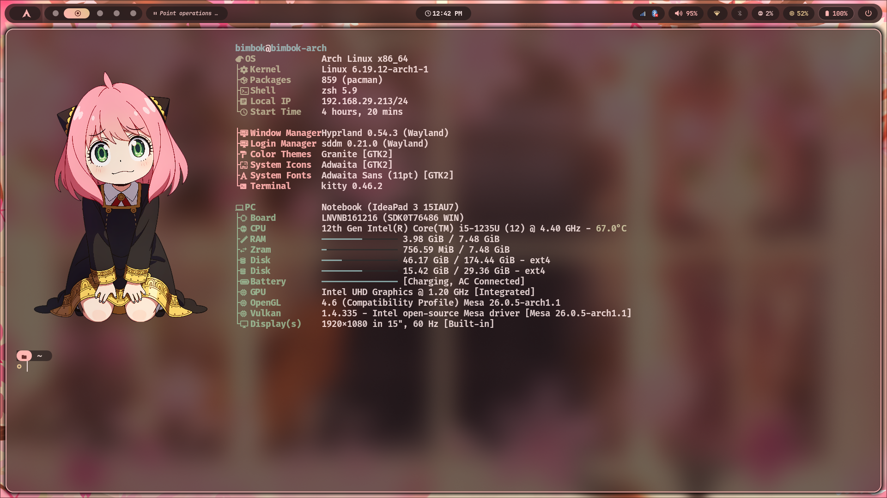
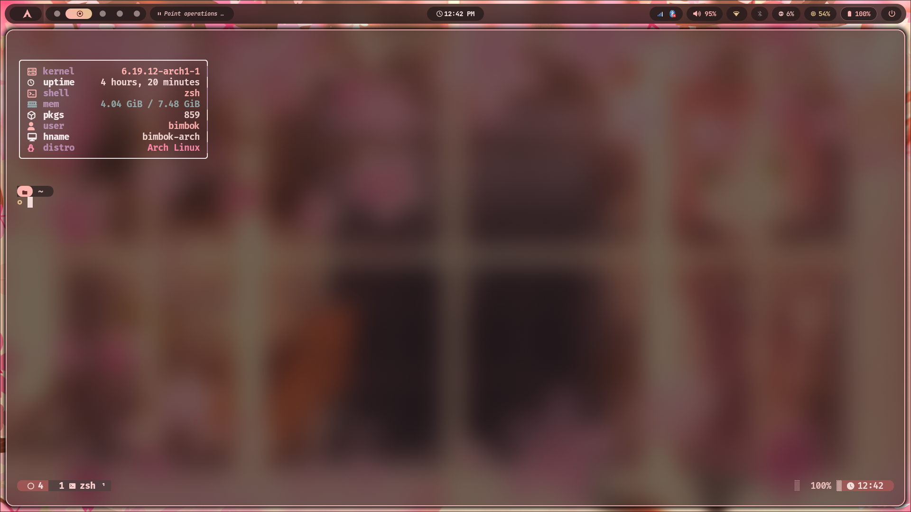

# 🚀 Personal Fastfetch Configurations

A collection of highly customized `fastfetch` configurations tailored for different terminal environments and aesthetics. This setup includes dynamic switching between image-based and ASCII-based layouts.

## 📁 Configuration Overview

| Config | Logo Type | Image/Source | Best For |
| :--- | :--- | :--- | :--- |
| **`config.jsonc`** | `kitty-direct` | `anya.png` | Standard high-detail system info. |
| **`config-marin.jsonc`** | `kitty-direct` | `marin.png` | Clean, modern layout for Kitty/Ghostty. |
| **`config-tmux.jsonc`** | `file` (ASCII) | `ascii.txt` | Tmux sessions or low-resource shells. |

---

### 1. 🖼️ Marin Layout (`config-marin.jsonc`)
Designed specifically for modern terminals like **Kitty** or **Ghostty**. It uses the `kitty-direct` protocol to render a high-quality image of Marin Kitagawa.
- **Key Features:** Compact module layout, custom color glyphs, and high-quality image rendering.
- **Logo:** `marin.png`

### 2. 🐚 Tmux Optimized (`config-tmux.jsonc`)
Tmux often struggles with inline image protocols. This configuration swaps the image for a clean **ASCII art** logo (`ascii.txt`) to ensure a consistent experience without graphical glitches.
- **Key Features:** Nerd Font icons (, , ), magenta/green accents, and a minimal footprint.
- **Logo:** `ascii.txt`

### 3. 🍱 Standard "Anya" Layout (`config.jsonc`)
The "Kitchen Sink" configuration. It provides exhaustive details about your hardware, software, and environment.
- **Key Features:** Detailed bars for RAM/Disk usage, CPU temperature monitoring, and comprehensive system pathing.
- **Logo:** `anya.png`

---

## 🛠️ Dynamic Startup Setup

To automatically use the best configuration based on whether you are inside a Tmux session, add the following snippet to your `.zshrc` or `.bashrc`:

```bash
# fastfetch on startup launch
if [[ -n "$TMUX" ]]; then
    # Use ASCII config for Tmux compatibility
    fastfetch --config ~/.config/fastfetch/config-tmux.jsonc
else
    # Use Image config for Kitty/Ghostty/etc
    fastfetch --config ~/.config/fastfetch/config-marin.jsonc
fi
```

---

## 📸 Previews

### Logos
| Anya (`config.jsonc`) | Marin (`config-marin.jsonc`) |
| :---: | :---: |
|  |  |

### Screenshots
Below are full-terminal previews of the configurations in action:

#### 1. Marin Layout (Standard)


#### 2. Tmux Layout (ASCII)


#### 3. Anya Layout (Detailed)


#### 4. Anya Layout in Tmux


---

## 🚀 Installation

1. Clone or copy these files to `~/.config/fastfetch/`.
2. Ensure you have a **Nerd Font** installed for the icons to render correctly.
3. If using images, ensure your terminal supports the `kitty-direct` protocol.

```bash
# Manual run examples:
fastfetch --config ~/.config/fastfetch/config.jsonc
fastfetch --config ~/.config/fastfetch/config-marin.jsonc
fastfetch --config ~/.config/fastfetch/config-tmux.jsonc
```
