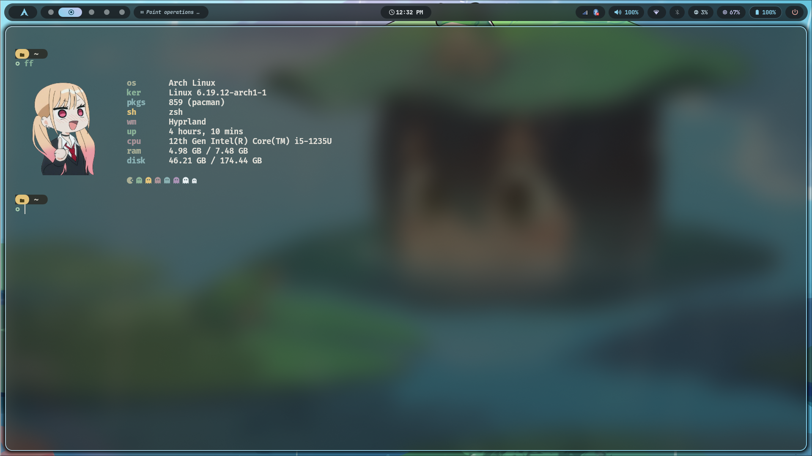
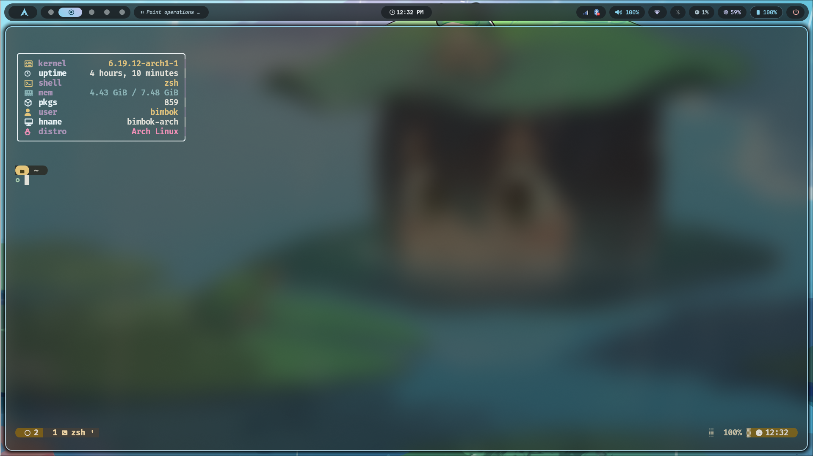

# Fastfetch Config

Personal `fastfetch` setup with:

- an image-based main config using `kitty-direct`
- a clean text-only variant for `tmux`

## Preview

### Marin Image


### Main Config



### Tmux Config



## Files

- `config.jsonc` - main config with the `marin.png` logo
- `config-tmux.jsonc` - compact border-style config for `tmux` or text-only environments
- `marin.png` - image used by the main config

## Requirements

- `fastfetch`
- a terminal that supports `kitty-direct` image rendering for `config.jsonc`

If your terminal does not support `kitty-direct`, use `config-tmux.jsonc` instead.

## Usage

Run the default config:

```bash
fastfetch --config ~/.config/fastfetch/config.jsonc
```

Run the tmux-friendly config:

```bash
fastfetch --config ~/.config/fastfetch/config-tmux.jsonc
```

Use this shell snippet to switch automatically when inside `tmux`:

```bash
if [[ -n "$TMUX" ]]; then
    fastfetch --config ~/.config/fastfetch/config-tmux.jsonc
else
    fastfetch
fi
```

## Install

Copy this directory into your Fastfetch config path:

```bash
mkdir -p ~/.config/fastfetch
cp config.jsonc config-tmux.jsonc marin.png ~/.config/fastfetch/
cp -r Sample ~/.config/fastfetch/
```

Then run either config with the commands above.
